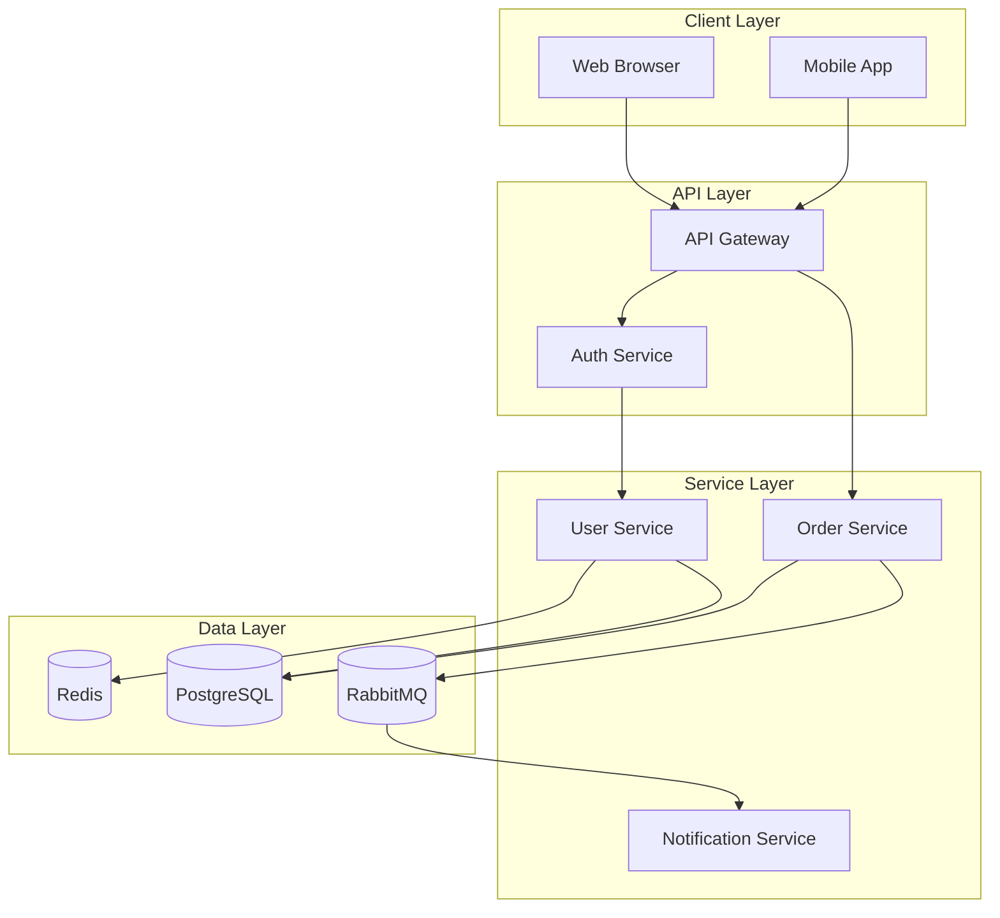
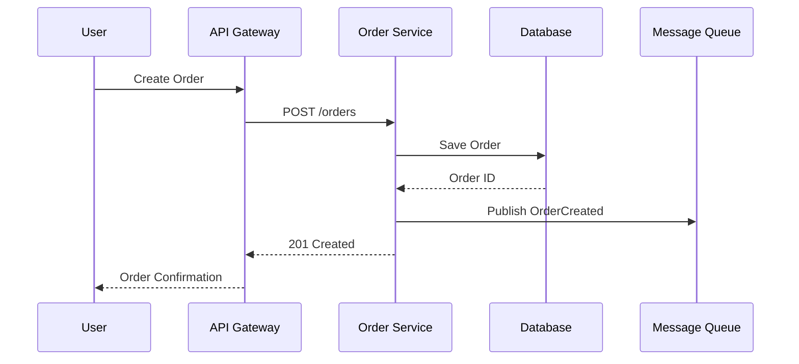
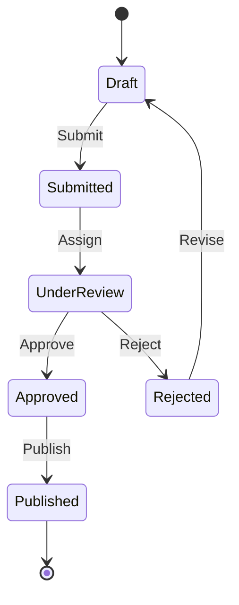
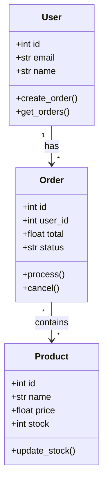
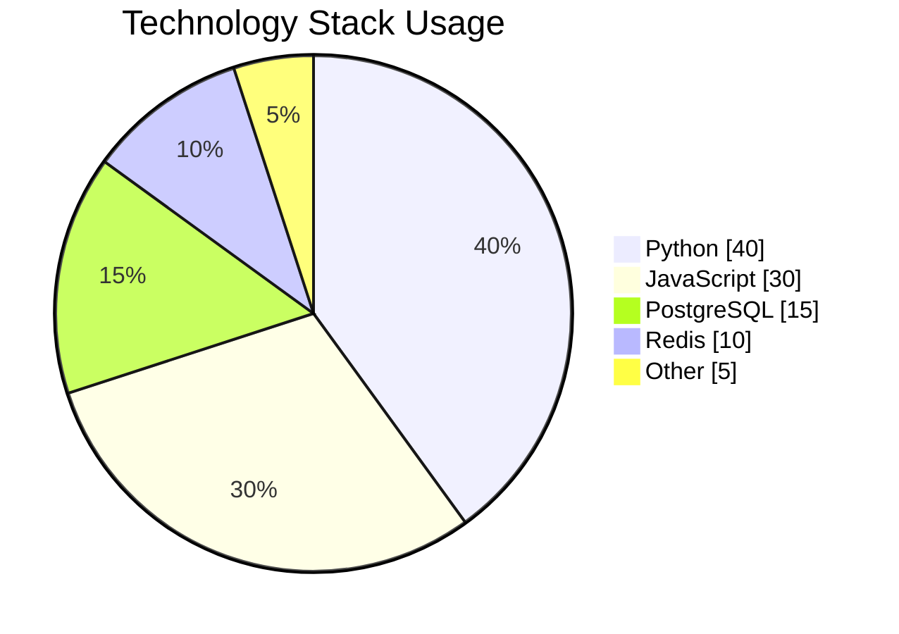
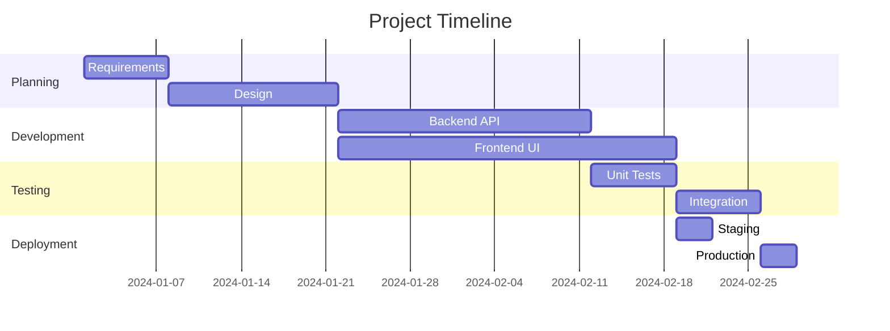
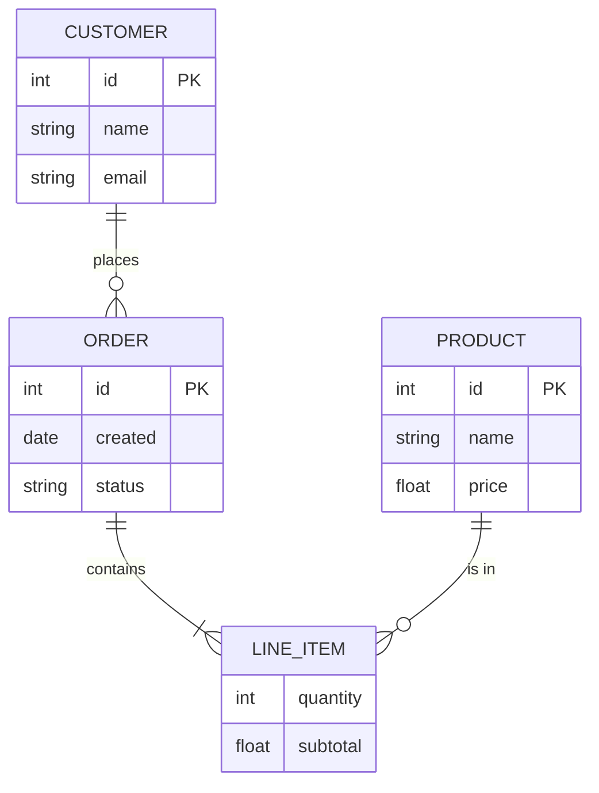

# Comprehensive Markdown Test

This file tests all markdown features alongside Mermaid diagrams.

## Headers

# H1 Header
## H2 Header
### H3 Header
#### H4 Header
##### H5 Header
###### H6 Header

## Text Formatting

**Bold text** and *italic text* and `inline code`.

~~Strikethrough~~ and **_bold italic_**.

## Architecture Overview

Here's a system architecture diagram:



## Data Flow

The following diagram shows how data flows through the system:



## Code Examples

### Python Example

```python
from dataclasses import dataclass
from typing import Optional
from datetime import datetime

@dataclass
class Order:
    """Represents a customer order."""
    id: int
    customer_id: int
    total: float
    status: str = "pending"
    created_at: Optional[datetime] = None

    def process(self) -> bool:
        """Process the order."""
        if self.status != "pending":
            return False
        self.status = "processing"
        return True

# Create and process an order
order = Order(
    id=1,
    customer_id=42,
    total=99.99,
    created_at=datetime.now()
)
order.process()
print(f"Order {order.id} status: {order.status}")
```

### JavaScript Example

```javascript
class EventEmitter {
    constructor() {
        this.events = new Map();
    }

    on(event, listener) {
        if (!this.events.has(event)) {
            this.events.set(event, []);
        }
        this.events.get(event).push(listener);
    }

    emit(event, ...args) {
        const listeners = this.events.get(event);
        if (listeners) {
            listeners.forEach(listener => listener(...args));
        }
    }
}

// Usage
const emitter = new EventEmitter();
emitter.on('order:created', (order) => {
    console.log(`New order: ${order.id}`);
});
emitter.emit('order:created', { id: 123 });
```

## State Machine



## API Reference Table

| Endpoint | Method | Description | Auth |
|----------|--------|-------------|------|
| `/api/users` | GET | List all users | Required |
| `/api/users` | POST | Create new user | Required |
| `/api/users/{id}` | GET | Get user by ID | Required |
| `/api/users/{id}` | PUT | Update user | Required |
| `/api/users/{id}` | DELETE | Delete user | Admin |
| `/api/orders` | GET | List orders | Required |
| `/api/orders` | POST | Create order | Required |

## Class Diagram



## Blockquotes

> **Note:** This is an important notice about the system.
>
> It can contain multiple paragraphs and even `code`.

## Checklists

- [x] Design architecture
- [x] Implement API layer
- [x] Add authentication
- [ ] Write tests
- [ ] Deploy to production
- [ ] Monitor and optimize

## Pie Chart



## Gantt Chart



## Mathematical Notation

The system uses the formula: `E = mc²`

For complex calculations, we use:

```
total = Σ(price_i × quantity_i) for all items
```

## Horizontal Rules

---

Above and below are horizontal rules.

---

## Mixed Content Test

Here's a list with code:

1. First, install dependencies:

   ```bash
   pip install fastapi uvicorn
   ```

2. Then, run the server:

   ```bash
   python app.py myfile.md
   ```

3. Open your browser to `http://localhost:8000`

## Entity Relationship Diagram



## Final Notes

This comprehensive test file demonstrates:

1. All standard markdown features
2. Multiple Mermaid diagram types
3. Syntax highlighted code blocks
4. Tables and lists
5. Various text formatting options

The viewer should render all of these correctly with proper styling and interactivity for the diagrams.