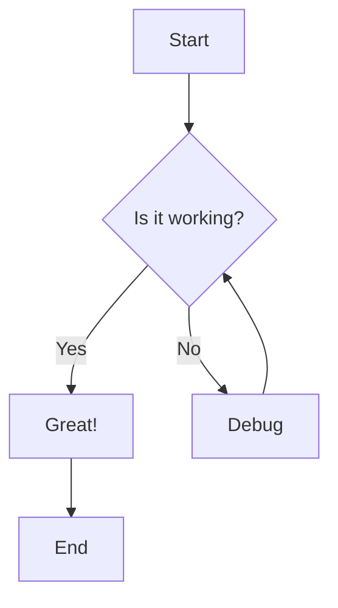
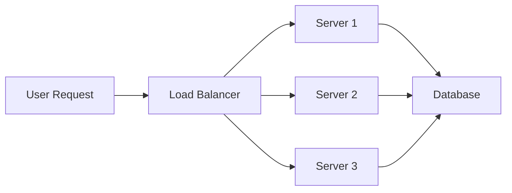
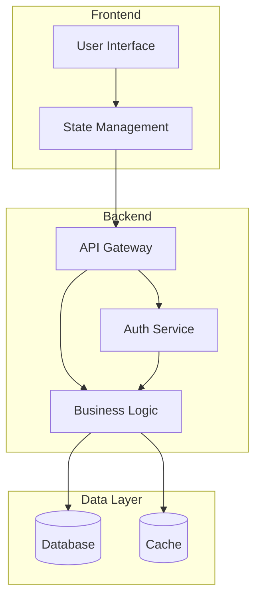
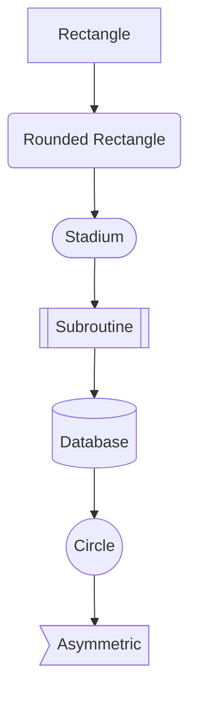
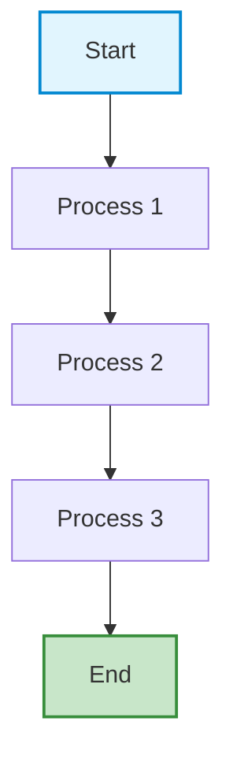

# Mermaid Flowchart Examples

## Simple Flowchart

```mermaid
graph TD
    A[Start] --> B{Is it working?}
    B -->|Yes| C[Great!]
    B -->|No| D[Debug]
    D --> B
    C --> E[End]
```

## Left to Right Flowchart

```mermaid
graph LR
    A[User Request] --> B[Load Balancer]
    B --> C[Server 1]
    B --> D[Server 2]
    B --> E[Server 3]
    C --> F[Database]
    D --> F
    E --> F
```

## Complex Flowchart with Subgraphs

```mermaid
graph TB
    subgraph "Frontend"
        A[User Interface]
        B[State Management]
    end

    subgraph "Backend"
        C[API Gateway]
        D[Auth Service]
        E[Business Logic]
    end

    subgraph "Data Layer"
        F[(Database)]
        G[(Cache)]
    end

    A --> B
    B --> C
    C --> D
    C --> E
    D --> E
    E --> F
    E --> G
```

## Flowchart with Different Shapes

```mermaid
graph TD
    A[Rectangle]
    B(Rounded Rectangle)
    C([Stadium])
    D[[Subroutine]]
    E[(Database)]
    F((Circle))
    G>Asymmetric]

    A --> B
    B --> C
    C --> D
    D --> E
    E --> F
    F --> G
```

## Styling Example

```mermaid
graph TD
    A[Start] --> B[Process 1]
    B --> C[Process 2]
    C --> D[Process 3]
    D --> E[End]

    style A fill:#e1f5fe,stroke:#0288d1,stroke-width:2px
    style E fill:#c8e6c9,stroke:#388e3c,stroke-width:2px
```