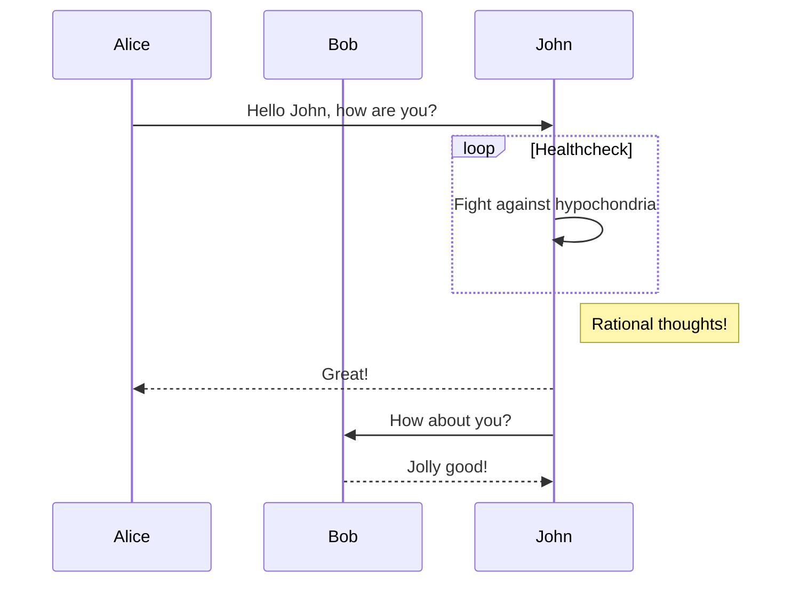
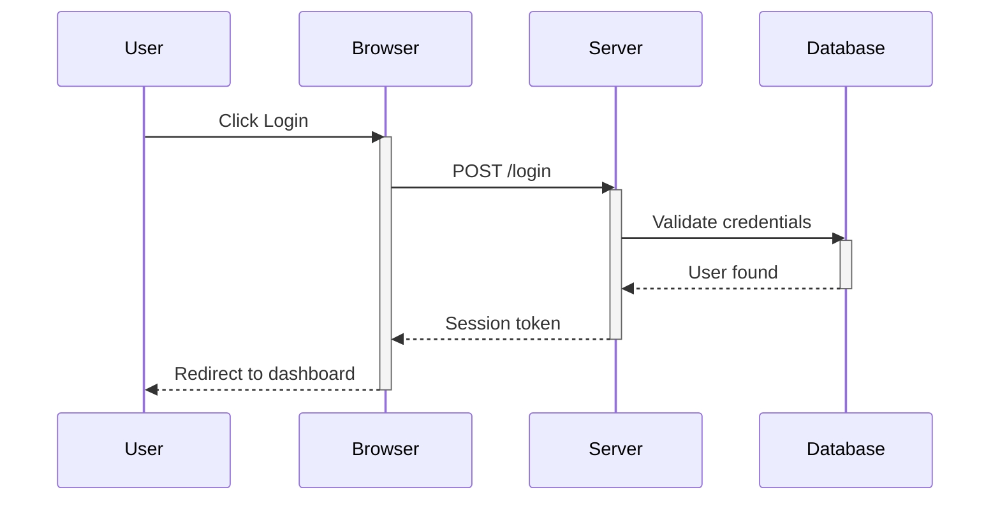
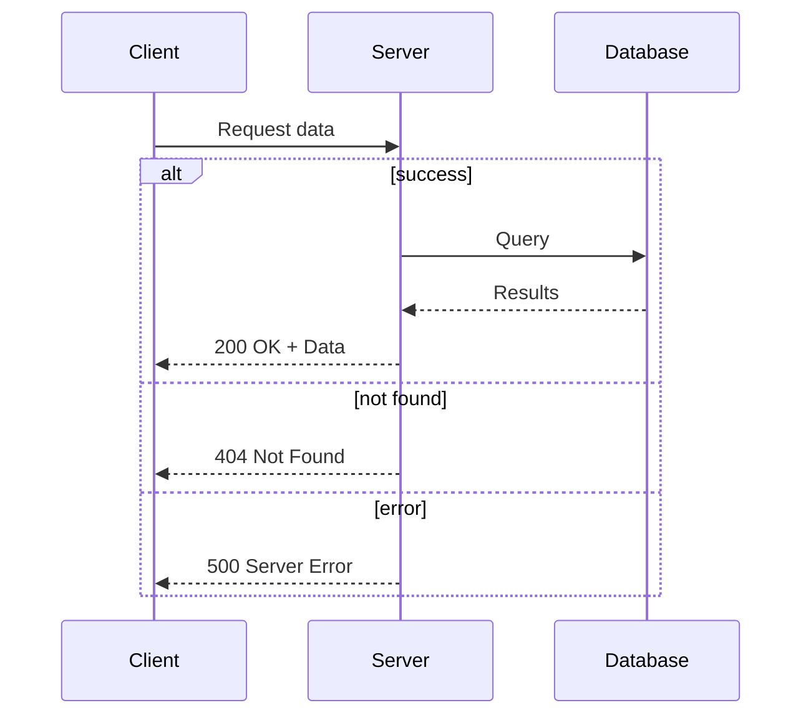
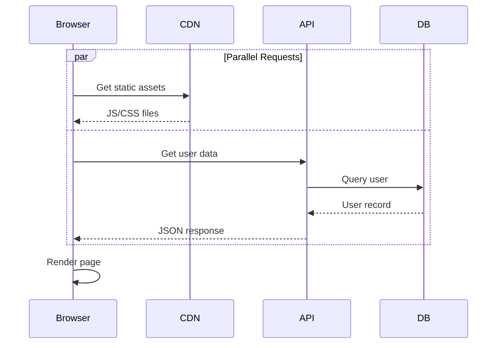
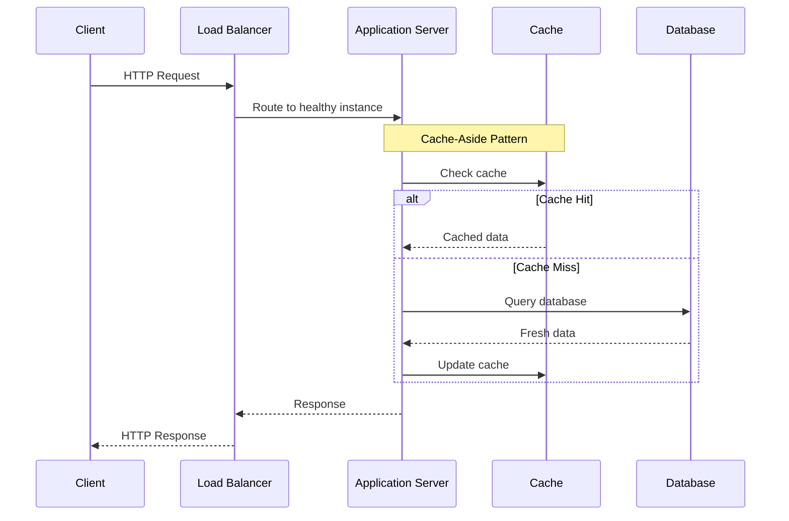

# Mermaid Sequence Diagram Examples

## Simple Sequence Diagram

## Sequence Diagram with Activation

## Sequence Diagram with Alternatives

## Sequence Diagram with Parallel

## Sequence Diagram with Notes

